# V:ON ERP Entity Relationship Diagram (ERD)

본 문서는 시스템의 핵심 도메인별 물리 데이터베이스(SQLAlchemy Models) 간의 연관관계를 도식화한 엔티티 관계도(ERD)입니다.

## 1. 종합 엔티티 관계도 (Mermaid)

```mermaid
erDiagram
    %% ==========================================
    %% 1. Core / Foundation Domain
    %% ==========================================
    users {
        int id PK
        string email
        string full_name
        string role
        boolean is_active
    }

    gp_entities {
        int id PK
        string name
        string registration_number
    }

    %% ==========================================
    %% 2. Fund & LP Domain
    %% ==========================================
    funds {
        int id PK
        string name
        string type
        string status
        int target_amount
        int commitment_amount
        int gp_entity_id FK
    }

    lps {
        int id PK
        string name
        string type
        int commitment_amount
        int paid_in
        int fund_id FK
    }

    lp_address_books {
        int id PK
        string name
        string type
        string business_number
        string email
    }

    %% ==========================================
    %% 3. Capital Call & Contribution Domain
    %% ==========================================
    capital_calls {
        int id PK
        string name
        date call_date
        date due_date
        int total_amount
        int fund_id FK
    }

    capital_call_items {
        int id PK
        int amount
        boolean paid
        date paid_date
        int capital_call_id FK
        int lp_id FK
    }

    distributions {
        int id PK
        string name
        date distribution_date
        int total_amount
        int fund_id FK
    }

    distribution_items {
        int id PK
        int amount
        int distribution_id FK
        int lp_id FK
    }

    lp_transfers {
        int id PK
        date transfer_date
        int amount
        int fund_id FK
        int from_lp_id FK
        int to_lp_id FK
    }

    %% ==========================================
    %% 4. Task & Workflow Domain
    %% ==========================================
    tasks {
        int id PK
        string title
        string status
        string priority
        date deadline
        int fund_id FK
        int gp_entity_id FK
        int assignee_id FK "Users"
        boolean is_notice
        boolean is_report
    }

    workflow_templates {
        int id PK
        string name
        string category
    }

    workflows {
        int id PK
        string name
        string status
        int fund_id FK
        int template_id FK
    }

    workflow_steps {
        int id PK
        string name
        int order
        string status
        int workflow_id FK
    }

    workflow_documents {
        int id PK
        string name
        boolean required
        int workflow_id FK
    }

    %% ==========================================
    %% 5. Investment & Valuation Domain
    %% ==========================================
    investments {
        int id PK
        string company_name
        date investment_date
        int amount
        int shares
        int fund_id FK
    }

    valuations {
        int id PK
        date valuation_date
        int valuation_amount
        int investment_id FK
    }

    exits {
        int id PK
        date exit_date
        int proceeds
        int shares_sold
        int investment_id FK
    }

    %% ==========================================
    %% 6. Reports & Notice Domain
    %% ==========================================
    calendar_events {
        int id PK
        string title
        string event_type
        date start_date
        int fund_id FK
        int task_id FK
    }

    fund_notice_periods {
        int id PK
        string name
        string period_type
        int fund_id FK
    }

    biz_reports {
        int id PK
        string title
        int fund_id FK
    }

    regular_reports {
        int id PK
        string title
        string period
        int fund_id FK
    }

    %% ==========================================
    %% Relationships
    %% ==========================================
    
    %% Users & Org
    gp_entities ||--o{ funds : "Manages"
    users ||--o{ tasks : "Assigned To"

    %% Fund -> LP
    funds ||--o{ lps : "Has"
    lp_address_books ||--o{ lps : "References Profile"

    %% Fund -> Capital Call
    funds ||--o{ capital_calls : "Makes"
    capital_calls ||--o{ capital_call_items : "Has Items"
    lps ||--o{ capital_call_items : "Pays"
    
    %% Fund -> Distribution / Transfer
    funds ||--o{ distributions : "Distributes"
    distributions ||--o{ distribution_items : "Has Items"
    lps ||--o{ distribution_items : "Receives"
    
    funds |o--o{ lp_transfers : "Registers"
    lps ||--o{ lp_transfers : "From/To"

    %% Fund -> Task
    funds ||--o{ tasks : "Has Tasks"
    gp_entities ||--o{ tasks : "Has Corp Tasks"

    %% Workflow
    workflow_templates ||--o{ workflows : "Instantiates"
    funds ||--o{ workflows : "Has Workflow"
    workflows ||--o{ workflow_steps : "Contains Steps"
    workflows ||--o{ workflow_documents : "Requires Docs"

    %% Investment
    funds ||--o{ investments : "Invests In"
    investments ||--o{ valuations : "Evaluated By"
    investments ||--o{ exits : "Exits From"

    %% Notice & Report & Event
    funds ||--o{ calendar_events : "Has Events"
    tasks |o--o| calendar_events : "Shows on Calendar"
    funds ||--o{ fund_notice_periods : "Has Notice Rules"
    funds ||--o{ biz_reports : "Generates"
    funds ||--o{ regular_reports : "Generates"
```

## 2. 도메인별 주요 설계 정책 및 Cascade Rules

1. **조합(Fund) 중앙 집중 구조:** `CapitalCall`, `Investment`, `Task`, `Workflow` 등 거의 모든 마스터 데이터는 `fund_id`를 외래키로 가집니다. **(수동 Cascade 정책 유의 필요 - 관련 Task는 지우되 완료된 Workflow는 보존)**
2. **단일 진실 공급원 (SSOT):** 납입액(`paid_in`) 값은 `CapitalCallItem.paid=True` 인 항목들의 총합(`amount`)과 항상 100% 일관성을 유지해야 합니다.
3. **Task 연계 파생:** `Task` 생성 시 `is_notice`, `is_report` Boolean 플래그와 `deadline`에 따라 대시보드 및 통지/보고 탭에 데이터가 다중 노출됩니다.