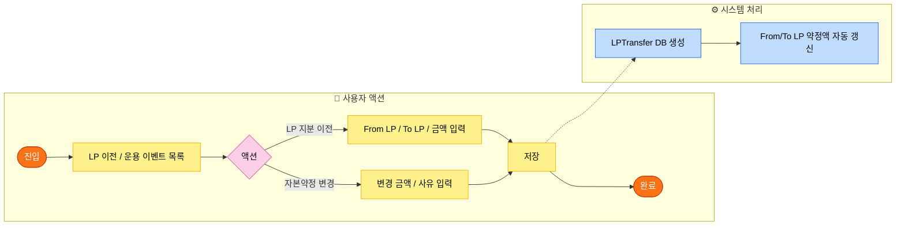
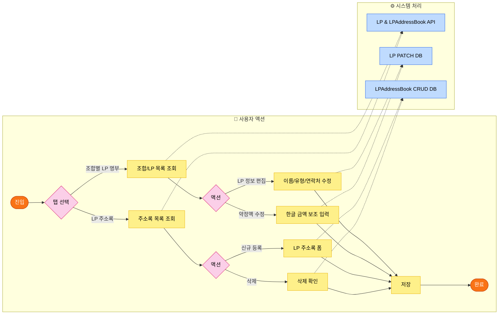
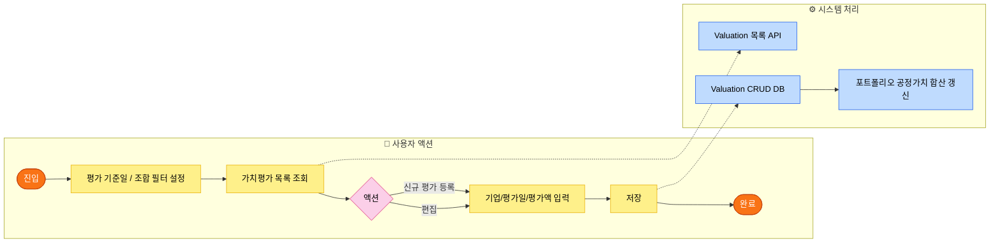
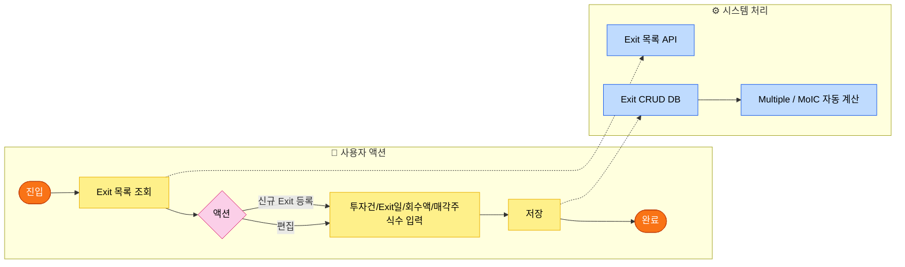
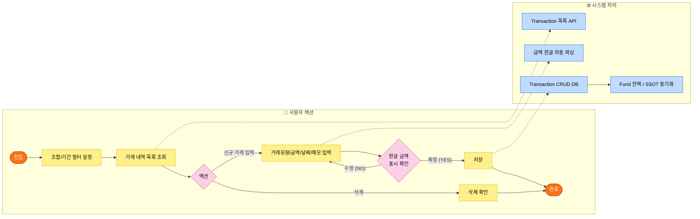
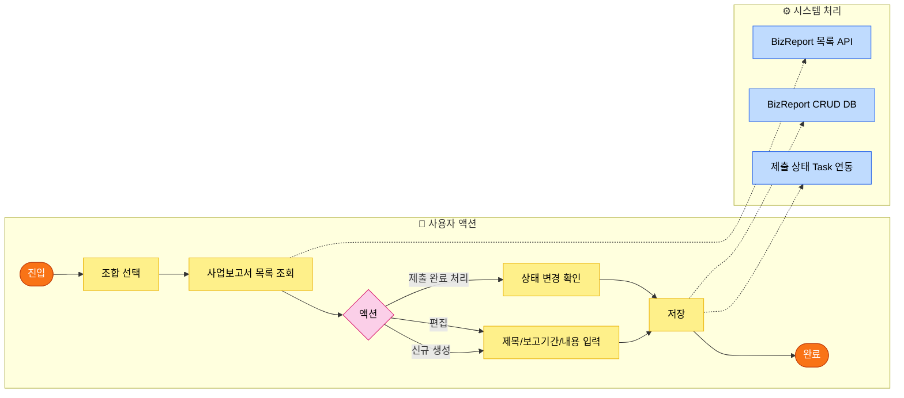

# V:ON ERP 전체 페이지별 시스템 플로우차트 (PM 설계 기준)

> **작성 원칙:** 이미지 분석 기반의 **Swimlane(수영장 레인)** 구조 적용
> - 상단 레인: **사용자 액션(User Action)** — 화면에서의 클릭/입력/선택
> - 하단 레인: **시스템 처리(System)** — 프론트/백엔드 데이터 처리 및 DB 연동
> - 범례: 🟠 시작/종료 · 🟡 프로세스 · 🩷 판단/분기 · 🔵 시스템 처리

---

## Page 01 · `/dashboard` — 게이트웨이 대시보드

> **역할:** 1~2인 VC 관리팀을 위한 경량 'Hub'. KPI 위젯, 긴급 업무, 자본 알림만 표시하고 실무는 하위 페이지로 라우팅합니다.

```mermaid
flowchart LR
    classDef startEnd fill:#f97316,stroke:#c2410c,color:#fff
    classDef proc fill:#fef08a,stroke:#eab308,color:#000
    classDef dec fill:#fbcfe8,stroke:#db2777,color:#000
    classDef sys fill:#bfdbfe,stroke:#2563eb,color:#000

    subgraph User ["👤 사용자 액션"]
        direction LR
        S([로그인]):::startEnd --> D1[대시보드 진입]:::proc
        D1 --> D2{위젯 확인}:::dec
        D2 -- "긴급 Task 클릭" --> D3[업무보드 이동]:::proc
        D2 -- "펀드 요약 클릭" --> D4[펀드 상세 이동]:::proc
        D2 -- "캐피탈콜 알림" --> D5[자금 운용 이동]:::proc
        D3 & D4 & D5 --> E([완료]):::startEnd
    end

    subgraph Sys ["⚙️ 시스템 처리"]
        direction LR
        SY1[전체 Fund/Task/CapitalCall\nAPI 병렬 호출]:::sys
        SY2[D-Day 기반 긴급 Task\n자동 필터링]:::sys
        SY3[KPI 위젯 렌더링\n(총 AUM / 마감 건수 / 알림)]:::sys
    end

    D1 -.->|데이터 요청| SY1
    SY1 --> SY2 --> SY3
```

---

## Page 02 · `/tasks` — 업무 보드 (Task Board)

> **역할:** 아이젠하워 매트릭스(Q1~Q4) 기반 Kanban 보드. 개별 Task 생성/편집/완료/삭제 및 워크플로 연동.

```mermaid
flowchart LR
    classDef startEnd fill:#f97316,stroke:#c2410c,color:#fff
    classDef proc fill:#fef08a,stroke:#eab308,color:#000
    classDef dec fill:#fbcfe8,stroke:#db2777,color:#000
    classDef sys fill:#bfdbfe,stroke:#2563eb,color:#000

    subgraph User ["👤 사용자 액션"]
        direction LR
        S([진입]):::startEnd --> T1[Q1~Q4 칸반 보드 조회]:::proc
        T1 --> T2{액션 선택}:::dec
        T2 -- "Task 생성" --> T3[폼 작성\n(제목/마감/우선순위/연결펀드)]:::proc
        T2 -- "Task 클릭" --> T4[상세 모달 열기]:::proc
        T2 -- "워크플로 연동" --> T5[워크플로 선택 후 생성]:::proc
        T2 -- "체크박스 다중선택" --> T10[Bulk Action Bar 표시]:::proc
        T10 --> T11{일괄 액션}:::dec
        T11 -- "일괄 완료" --> T12[일괄 소요시간 입력\n또는 개별 완료모달 순차 진행]:::proc
        T11 -- "일괄 삭제" --> T13[삭제 확인]:::proc
        T4 --> T6{완료 클릭}:::dec
        T6 -- "실제시간 기입" --> T7[완료 모달 확인]:::proc
        T7 --> T6A{필수서류/금액 경고\ncompletion-check}:::dec
        T6A -- "서류 미충족" --> T6B[완료 버튼 잠금\n누락 서류 안내]:::proc
        T6A -- "완료 가능" --> T8[WorkLog 자동 기록 여부 선택]:::proc
        T2 -- "드래그" --> T9[Q간 이동]:::proc
        T8 & T9 & T3 & T12 & T13 --> E([완료]):::startEnd
    end

    subgraph Sys ["⚙️ 시스템 처리"]
        direction LR
        SY1[TaskBoard API 호출\n(Q1~Q4 분류)]:::sys
        SY2[Task 생성 DB 저장]:::sys
        SY2A[Task completion-check API\n(필수서류/캐피탈콜 경고)]:::sys
        SY3[Task 상태 완료 처리]:::sys
        SY4[WorkLog 자동 생성 (선택 시)]:::sys
        SY5[Task 우선순위(Quadrant) DB 이동]:::sys
        SY6[CalendarEvent 연동]:::sys
        SY7[Bulk Complete / Bulk Delete API]:::sys
    end

    T1 -.-> SY1
    T3 -.-> SY2
    T7 -.-> SY2A
    T8 -.-> SY3 --> SY4
    T9 -.-> SY5
    T12 & T13 -.-> SY7
    SY2 & SY3 --> SY6
```

---

## Page 03 · `/workflows` — 워크플로 관리

> **역할:** 결성/청산/캐피탈콜 등 표준 업무절차(SOP)를 템플릿으로 관리하고, 조합에 인스턴스를 생성하여 단계별 처리합니다.

```mermaid
flowchart LR
    classDef startEnd fill:#f97316,stroke:#c2410c,color:#fff
    classDef proc fill:#fef08a,stroke:#eab308,color:#000
    classDef dec fill:#fbcfe8,stroke:#db2777,color:#000
    classDef sys fill:#bfdbfe,stroke:#2563eb,color:#000

    subgraph User ["👤 사용자 액션"]
        direction LR
        S([진입]):::startEnd --> W1{탭 선택}:::dec
        W1 -- "진행 중 워크플로" --> W2[인스턴스 목록 조회]:::proc
        W1 -- "템플릿 관리" --> W3[템플릿 목록 조회]:::proc

        W2 --> W4{인스턴스 액션}:::dec
        W4 -- "단계 완료" --> W5{필수 서류 첨부\n여부 확인}:::dec
        W5 -- "첨부 없음 (NO)" --> W6[오류 표시 / Lock]:::proc
        W5 -- "완료 (YES)" --> W7[단계 완료 처리]:::proc
        W4 -- "인쇄" --> W8[체크리스트 프린트]:::proc
        W4 -- "취소" --> W9[워크플로 취소 확인]:::proc

        W3 --> W10{템플릿 액션}:::dec
        W10 -- "신규 생성" --> W11[템플릿 폼\n(이름/카테고리/단계)]:::proc
        W10 -- "편집" --> W11
        W11 --> W12[저장]:::proc
        W12 --> E([완료]):::startEnd
        W7 & W8 & W9 --> E
    end

    subgraph Sys ["⚙️ 시스템 처리"]
        direction LR
        SY1[워크플로 인스턴스 & 템플릿 API]:::sys
        SY2[서류 첨부 유무 Validation]:::sys
        SY3[단계 Status DB 업데이트]:::sys
        SY4[다음 단계 Task 자동 생성]:::sys
        SY5[템플릿 CRUD DB 반영]:::sys
    end

    W2 & W3 -.-> SY1
    W5 -.-> SY2
    W7 -.-> SY3 --> SY4
    W12 -.-> SY5
```

---

## Page 04 · `/worklogs` — 업무 일지 (WorkLogs)

> **역할:** Task 완료 시 자동/수동으로 기록된 업무 일지를 조회하고 관리합니다.

```mermaid
flowchart LR
    classDef startEnd fill:#f97316,stroke:#c2410c,color:#fff
    classDef proc fill:#fef08a,stroke:#eab308,color:#000
    classDef dec fill:#fbcfe8,stroke:#db2777,color:#000
    classDef sys fill:#bfdbfe,stroke:#2563eb,color:#000

    subgraph User ["👤 사용자 액션"]
        direction LR
        S([진입]):::startEnd --> L1[날짜/펀드/담당자 필터 설정]:::proc
        L1 --> L2[업무 일지 목록 조회]:::proc
        L2 --> L3{액션}:::dec
        L3 -- "상세 열기" --> L4[일지 상세 모달]:::proc
        L3 -- "수동 기록 추가" --> L5[업무명/소요시간 기입]:::proc
        L3 -- "삭제" --> L6[삭제 확인]:::proc
        L4 & L5 & L6 --> E([완료]):::startEnd
    end

    subgraph Sys ["⚙️ 시스템 처리"]
        direction LR
        SY1[WorkLog API\n(필터 파라미터 포함)]:::sys
        SY2[WorkLog 수동 생성 DB]:::sys
        SY3[WorkLog 삭제 DB]:::sys
    end

    L2 -.-> SY1
    L5 -.-> SY2
    L6 -.-> SY3
```

---

## Page 05 · `/funds` — 조합(Fund) 목록 및 생성

> **역할:** VC가 운용하는 조합(Fund) 전체를 등록/조회하고, LP 명부와 함께 최초 등록합니다. Excel 데이터 마이그레이션도 지원합니다.

```mermaid
flowchart LR
    classDef startEnd fill:#f97316,stroke:#c2410c,color:#fff
    classDef proc fill:#fef08a,stroke:#eab308,color:#000
    classDef dec fill:#fbcfe8,stroke:#db2777,color:#000
    classDef sys fill:#bfdbfe,stroke:#2563eb,color:#000

    subgraph User ["👤 사용자 액션"]
        direction LR
        S([진입]):::startEnd --> F1[조합 목록 조회]:::proc
        F1 --> F2{액션}:::dec
        F2 -- "신규 조합 생성" --> F3[조합 기본정보 입력\n(유형/GP/목표금액/날짜)]:::proc
        F3 --> F4[LP 명부 추가\n(LP 유형/약정액)]:::proc
        F4 --> F5{GP 유형 LP\n포함 여부}:::dec
        F5 -- "YES" --> F6[GP 정보 자동 완성]:::proc
        F5 -- "NO" --> F7[저장]:::proc
        F6 --> F7
        F2 -- "상세 진입" --> F8[FundDetailPage 이동]:::proc
        F2 -- "Excel 마이그레이션" --> F9[템플릿 다운로드 → 업로드]:::proc
        F7 & F8 & F9 --> E([완료]):::startEnd
    end

    subgraph Sys ["⚙️ 시스템 처리"]
        direction LR
        SY1[Fund & GPEntity API 조회]:::sys
        SY2[GP Entity 정보 자동 바인딩]:::sys
        SY3[Fund + LP 일괄 생성 DB]:::sys
        SY4[Excel 파싱 및 데이터 유효성 검증]:::sys
        SY5[마이그레이션 결과 리포트 반환]:::sys
    end

    F1 -.-> SY1
    F6 -.-> SY2
    F7 -.-> SY3
    F9 -.-> SY4 --> SY5
```

---

## Page 06 · `/fund-overview` — 조합 종합 현황

> **역할:** 전체 조합의 AUM, 상태, 투자 진행률 등을 한눈에 비교하는 대시보드형 조회 페이지.

```mermaid
flowchart LR
    classDef startEnd fill:#f97316,stroke:#c2410c,color:#fff
    classDef proc fill:#fef08a,stroke:#eab308,color:#000
    classDef dec fill:#fbcfe8,stroke:#db2777,color:#000
    classDef sys fill:#bfdbfe,stroke:#2563eb,color:#000

    subgraph User ["👤 사용자 액션"]
        direction LR
        S([진입]):::startEnd --> O1[전체 조합 현황 카드 조회]:::proc
        O1 --> O2{조합 카드 선택}:::dec
        O2 -- "상세 클릭" --> O3[FundDetailPage 이동]:::proc
        O2 -- "계속 조회" --> O1
        O3 --> E([완료]):::startEnd
    end

    subgraph Sys ["⚙️ 시스템 처리"]
        direction LR
        SY1[모든 Fund 데이터 집계\n(AUM/상태/비율)]:::sys
    end

    O1 -.-> SY1
```

---

## Page 07 · `/funds/:id` — 조합 상세 (Fund Detail) — 핵심 페이지

> **역할:** 개별 조합의 5개 탭을 통해 조합의 전 생애주기(결성→운용→청산)를 관리합니다.

```mermaid
flowchart LR
    classDef startEnd fill:#f97316,stroke:#c2410c,color:#fff
    classDef proc fill:#fef08a,stroke:#eab308,color:#000
    classDef dec fill:#fbcfe8,stroke:#db2777,color:#000
    classDef sys fill:#bfdbfe,stroke:#2563eb,color:#000

    subgraph User ["👤 사용자 액션"]
        direction LR
        S([진입]):::startEnd --> TAB{탭 선택}:::dec

        TAB -- "대시보드 탭" --> T_D[KPI 카드 / 워크플로 상태 조회]:::proc

        TAB -- "기본정보 탭" --> T_I[조합 기본정보 편집\n(상태/GP/날짜/수수료)]:::proc
        T_I --> T_I2[통지기간 규칙 편집]:::proc
        T_I2 --> SAVE_I[저장]:::proc

        TAB -- "자본 및 LP 현황 탭" --> T_C[캐피탈콜 목록 / LP 납입 현황]:::proc
        T_C --> T_C2{캐피탈콜 액션}:::dec
        T_C2 -- "신규 생성" --> T_C3[캐피탈콜 폼\n(총금액/납입기일/LP별금액)]:::proc
        T_C2 -- "LP 납입 확인" --> T_C4[LP별 paid 체크]:::proc
        T_C3 & T_C4 --> SAVE_C[저장]:::proc

        TAB -- "투자 포트폴리오 탭" --> T_P[투자 기업 목록 조회]:::proc
        T_P --> T_P2[InvestmentDetailPage 이동]:::proc

        TAB -- "규약 및 컴플라이언스 탭" --> T_R[Key Terms / 총회 / 분배 관리]:::proc
        T_R --> T_R2{액션}:::dec
        T_R2 -- "분배 생성" --> T_R3[분배 폼\n(원금/수익/LP별)]:::proc
        T_R2 -- "총회 기록" --> T_R4[총회 폼\n(날짜/종류/안건)]:::proc
        T_R3 & T_R4 --> SAVE_R[저장]:::proc

        SAVE_I & SAVE_C & SAVE_R --> E([완료]):::startEnd
        T_P2 --> E
    end

    subgraph Sys ["⚙️ 시스템 처리"]
        direction LR
        SY1[Fund 상세 및\n관련 도메인 전체 로드]:::sys
        SY2[기본정보 PATCH API]:::sys
        SY3[CapitalCall 생성 / LP paid 업데이트]:::sys
        SY4[SSOT: Fund.paid_in 자동 재계산]:::sys
        SY5[Distribution 생성 DB]:::sys
        SY6[Assembly 기록 DB]:::sys
    end

    S -.-> SY1
    SAVE_I -.-> SY2
    SAVE_C -.-> SY3 --> SY4
    SAVE_R -.-> SY5 & SY6
```

---

## Page 08 · `/fund-operations` — 조합 운용 (Fund Operations)

> **역할:** LP 지분이전(Transfer), 자본약정 변경 등 운용 중 발생하는 특수 이벤트를 처리합니다.



---

## Page 09 · `/lp-management` — LP 관리 (명부 + 주소록)

> **역할:** 조합별 LP 목록과, 시스템 전체에서 재활용할 수 있는 LP 주소록(Address Book)을 통합 관리합니다.



---

## Page 10 · `/investments` — 투자 포트폴리오 목록

> **역할:** 전체 조합에 걸친 투자 기업의 목록을 조회하고 신규 투자를 등록합니다.

```mermaid
flowchart LR
    classDef startEnd fill:#f97316,stroke:#c2410c,color:#fff
    classDef proc fill:#fef08a,stroke:#eab308,color:#000
    classDef dec fill:#fbcfe8,stroke:#db2777,color:#000
    classDef sys fill:#bfdbfe,stroke:#2563eb,color:#000

    subgraph User ["👤 사용자 액션"]
        direction LR
        S([진입]):::startEnd --> I1[투자 포트폴리오 목록 조회]:::proc
        I1 --> I2{액션}:::dec
        I2 -- "신규 투자 등록" --> I3[기업명/투자일/금액/지분/조합 선택]:::proc
        I2 -- "상세 조회" --> I4[InvestmentDetailPage 이동]:::proc
        I3 --> I5[저장]:::proc
        I5 & I4 --> E([완료]):::startEnd
    end

    subgraph Sys ["⚙️ 시스템 처리"]
        direction LR
        SY1[Investment 목록 API\n(Fund 포함)]:::sys
        SY2[Investment DB 생성]:::sys
    end

    I1 -.-> SY1
    I5 -.-> SY2
```

---

## Page 11 · `/investments/:id` — 투자 상세 (Investment Detail)

> **역할:** 개별 투자 기업의 라운드별 내역, 가치평가, Exit, 기업 기본정보를 통합 관리합니다.

```mermaid
flowchart LR
    classDef startEnd fill:#f97316,stroke:#c2410c,color:#fff
    classDef proc fill:#fef08a,stroke:#eab308,color:#000
    classDef dec fill:#fbcfe8,stroke:#db2777,color:#000
    classDef sys fill:#bfdbfe,stroke:#2563eb,color:#000

    subgraph User ["👤 사용자 액션"]
        direction LR
        S([진입]):::startEnd --> ID1{탭 선택}:::dec
        ID1 -- "기본정보" --> ID2[기업명/업종/대표/연락처 편집]:::proc
        ID1 -- "투자 라운드" --> ID3[라운드별 투자 내역\n(금액/지분/계약서)]:::proc
        ID1 -- "가치평가" --> ID4[ValuationsPage 이동 or 인라인 추가]:::proc
        ID1 -- "Exit" --> ID5[ExitsPage 이동 or 인라인 추가]:::proc
        ID2 & ID3 & ID4 & ID5 --> ID6[저장]:::proc
        ID6 --> E([완료]):::startEnd
    end

    subgraph Sys ["⚙️ 시스템 처리"]
        direction LR
        SY1[Investment 상세 API\n(Valuations/Exits 포함)]:::sys
        SY2[투자 라운드 CRUD DB]:::sys
        SY3[Multiple / IRR 자동 계산\n(avg valuation 기반)]:::sys
    end

    S -.-> SY1
    ID3 & ID4 & ID5 -.-> SY2 --> SY3
```

---

## Page 12 · `/valuations` — 가치평가 관리

> **역할:** 전체 포트폴리오의 공정가치 평가를 주기별로 기록하고 조회합니다.



---

## Page 13 · `/exits` — Exit(회수) 관리

> **역할:** IPO, M&A, 장외매각 등 투자 회수 이벤트를 등록하고 수익률을 계산합니다.



---

## Page 14 · `/transactions` — 자금 거래 내역

> **역할:** 조합 계좌 기준의 출자/분배/기타 입출금 거래내역을 기록하고 조회합니다.



---

## Page 15 · `/accounting` — 회계 관리

> **역할:** 조합 원장 관리, 비용처리, 수익/비용 분류 등 회계 장부를 관리합니다.

```mermaid
flowchart LR
    classDef startEnd fill:#f97316,stroke:#c2410c,color:#fff
    classDef proc fill:#fef08a,stroke:#eab308,color:#000
    classDef dec fill:#fbcfe8,stroke:#db2777,color:#000
    classDef sys fill:#bfdbfe,stroke:#2563eb,color:#000

    subgraph User ["👤 사용자 액션"]
        direction LR
        S([진입]):::startEnd --> AC1[조합/기간/계정과목 필터]:::proc
        AC1 --> AC2[회계 항목 목록 조회]:::proc
        AC2 --> AC3{액션}:::dec
        AC3 -- "신규 전표 입력" --> AC4[계정과목/차변·대변/금액 입력]:::proc
        AC4 --> AC5{한글 금액\n확인}:::dec
        AC5 -- "수정 (NO)" --> AC4
        AC5 -- "확정 (YES)" --> AC6[저장]:::proc
        AC3 -- "임시저장" --> AC7[Draft 저장]:::proc
        AC6 & AC7 --> E([완료]):::startEnd
    end

    subgraph Sys ["⚙️ 시스템 처리"]
        direction LR
        SY1[Accounting 원장 API]:::sys
        SY2[금액 한글 자동 파싱]:::sys
        SY3[원장 DB 반영 (차/대변)]:::sys
        SY4[조합 재무상태 집계 갱신]:::sys
    end

    AC2 -.-> SY1
    AC4 -.-> SY2
    AC6 -.-> SY3 --> SY4
```

---

## Page 16 · `/biz-reports` — 사업보고서 관리

> **역할:** 금융위원회 등 규제 기관 제출용 사업보고서를 조합별로 작성하고 이력을 관리합니다.



---

## Page 17 · `/reports` — 정기 보고서 관리

> **역할:** LP 대상 분기/반기/연간 정기 보고서(영업보고서)를 작성하고 발송 이력을 관리합니다.

```mermaid
flowchart LR
    classDef startEnd fill:#f97316,stroke:#c2410c,color:#fff
    classDef proc fill:#fef08a,stroke:#eab308,color:#000
    classDef dec fill:#fbcfe8,stroke:#db2777,color:#000
    classDef sys fill:#bfdbfe,stroke:#2563eb,color:#000

    subgraph User ["👤 사용자 액션"]
        direction LR
        S([진입]):::startEnd --> RP1[조합 / 보고 기간 선택]:::proc
        RP1 --> RP2[정기 보고서 목록 조회]:::proc
        RP2 --> RP3{액션}:::dec
        RP3 -- "신규 작성" --> RP4[제목/기간/내용 입력 (템플릿 기반)]:::proc
        RP3 -- "발송 처리" --> RP5[발송 대상 LP / 날짜 확인]:::proc
        RP4 & RP5 --> RP6[저장]:::proc
        RP6 --> E([완료]):::startEnd
    end

    subgraph Sys ["⚙️ 시스템 처리"]
        direction LR
        SY1[RegularReport 목록 API]:::sys
        SY2[보고서 DB 저장]:::sys
        SY3[발송 이력 Task/Notice 연동]:::sys
    end

    RP2 -.-> SY1
    RP6 -.-> SY2 & SY3
```

---

## Page 18 · `/checklists` — 체크리스트

> **역할:** 결성/운용/청산 단계에서 필수로 수행해야 할 항목을 구조화된 체크리스트로 관리합니다.

```mermaid
flowchart LR
    classDef startEnd fill:#f97316,stroke:#c2410c,color:#fff
    classDef proc fill:#fef08a,stroke:#eab308,color:#000
    classDef dec fill:#fbcfe8,stroke:#db2777,color:#000
    classDef sys fill:#bfdbfe,stroke:#2563eb,color:#000

    subgraph User ["👤 사용자 액션"]
        direction LR
        S([진입]):::startEnd --> CL1[조합 / 단계 필터]:::proc
        CL1 --> CL2[체크리스트 목록 조회]:::proc
        CL2 --> CL3{항목 액션}:::dec
        CL3 -- "완료 체크" --> CL4[항목 완료 체크]:::proc
        CL3 -- "메모 추가" --> CL5[메모 입력]:::proc
        CL3 -- "서류 첨부" --> CL6{파일 업로드}:::dec
        CL6 -- "업로드 성공" --> CL7[첨부 완료]:::proc
        CL6 -- "실패" --> CL8[오류 표시]:::proc
        CL4 & CL5 & CL7 --> E([완료]):::startEnd
    end

    subgraph Sys ["⚙️ 시스템 처리"]
        direction LR
        SY1[Checklist 항목 API\n(워크플로 연동)]:::sys
        SY2[항목 상태 PATCH DB]:::sys
        SY3[첨부 파일 업로드 서버]:::sys
        SY4[전체 체크율 재계산]:::sys
    end

    CL2 -.-> SY1
    CL4 & CL5 -.-> SY2 --> SY4
    CL6 -.-> SY3
```

---

## Page 19 · `/documents` — 문서 관리 및 생성

> **역할:** 시스템 데이터와 바인딩하여 각종 통지문/서류를 자동 생성하고 보관합니다.

```mermaid
flowchart LR
    classDef startEnd fill:#f97316,stroke:#c2410c,color:#fff
    classDef proc fill:#fef08a,stroke:#eab308,color:#000
    classDef dec fill:#fbcfe8,stroke:#db2777,color:#000
    classDef sys fill:#bfdbfe,stroke:#2563eb,color:#000

    subgraph User ["👤 사용자 액션"]
        direction LR
        S([진입]):::startEnd --> DOC1[조합 / 문서유형 필터]:::proc
        DOC1 --> DOC2[문서 목록 조회]:::proc
        DOC2 --> DOC3{액션}:::dec
        DOC3 -- "자동 생성" --> DOC4[템플릿 선택\n+ 데이터 바인딩 옵션 설정]:::proc
        DOC4 --> DOC5{미리보기\n확인}:::dec
        DOC5 -- "수정 (NO)" --> DOC4
        DOC5 -- "확정 (YES)" --> DOC6[문서 생성 및 저장]:::proc
        DOC3 -- "수동 업로드" --> DOC7[파일 업로드]:::proc
        DOC6 & DOC7 --> E([완료]):::startEnd
    end

    subgraph Sys ["⚙️ 시스템 처리"]
        direction LR
        SY1[Document 목록 API]:::sys
        SY2[템플릿 + Fund/LP/CapitalCall\n데이터 바인딩 엔진]:::sys
        SY3[파일 생성 및 스토리지 저장]:::sys
    end

    DOC2 -.-> SY1
    DOC4 -.-> SY2
    DOC6 & DOC7 -.-> SY3
```



---

## Page 20 · `/templates` — 템플릿 관리 (문서/워크플로)

> **역할:** 워크플로 및 문서에서 재사용하는 서식/템플릿(서류 양식)을 중앙 관리합니다.

```mermaid
flowchart LR
    classDef startEnd fill:#f97316,stroke:#c2410c,color:#fff
    classDef proc fill:#fef08a,stroke:#eab308,color:#000
    classDef dec fill:#fbcfe8,stroke:#db2777,color:#000
    classDef sys fill:#bfdbfe,stroke:#2563eb,color:#000

    subgraph User ["👤 사용자 액션"]
        direction LR
        S([진입]):::startEnd --> TM1{탭 선택}:::dec
        TM1 -- "워크플로 템플릿" --> TM2[워크플로 템플릿 목록 조회]:::proc
        TM1 -- "문서 서식" --> TM3[문서 서식 목록 조회]:::proc

        TM2 --> TM4{액션}:::dec
        TM4 -- "신규" --> TM5[템플릿 폼 작성\n(단계/서류/경고 등)]:::proc
        TM4 -- "편집" --> TM5
        TM4 -- "삭제" --> TM6[삭제 확인]:::proc

        TM3 --> TM7{액션}:::dec
        TM7 -- "신규 서식 업로드" --> TM8[파일 업로드 + 이름 지정]:::proc
        TM7 -- "삭제" --> TM9[삭제 확인]:::proc

        TM5 & TM6 & TM8 & TM9 --> TM10[저장]:::proc
        TM10 --> E([완료]):::startEnd
    end

    subgraph Sys ["⚙️ 시스템 처리"]
        direction LR
        SY1[WorkflowTemplate & DocumentTemplate\nAPI 조회]:::sys
        SY2[템플릿 CRUD DB]:::sys
        SY3[서식 파일 스토리지 저장]:::sys
    end

    TM2 & TM3 -.-> SY1
    TM5 & TM6 -.-> SY2
    TM8 & TM9 -.-> SY3
```

---

## 시스템 전체 도메인 연결도 (Cross-Page Flow)

> 개별 페이지가 어떻게 서로 데이터를 연결하는지 보여주는 상위 수준 다이어그램입니다.

```mermaid
flowchart TD
    classDef hub fill:#f97316,stroke:#c2410c,color:#fff,font-weight:bold
    classDef domain fill:#bfdbfe,stroke:#2563eb,color:#000
    classDef task fill:#fef08a,stroke:#eab308,color:#000
    classDef report fill:#d1fae5,stroke:#059669,color:#000

    DASH([Dashboard Hub]):::hub

    subgraph FUND_DOMAIN ["🏦 펀드/LP 도메인"]
        Funds[Funds]:::domain --> FundDetail[FundDetail\n(5 Tabs)]:::domain
        FundDetail --> FundOps[FundOperations]:::domain
        Funds --> LPMgmt[LPManagement]:::domain
        FundDetail --> FundOverview[FundOverview]:::domain
    end

    subgraph TASK_DOMAIN ["📋 업무/워크플로 도메인"]
        Tasks[TaskBoard\n(Q1~Q4)]:::task --> Workflows[Workflows]:::task
        Tasks --> WorkLogs[WorkLogs]:::task
        Tasks --> Checklists[Checklists]:::task
    end

    subgraph INV_DOMAIN ["📈 투자/회수 도메인"]
        Investments[Investments]:::domain --> InvDetail[InvestmentDetail]:::domain
        InvDetail --> Valuations[Valuations]:::domain
        InvDetail --> Exits[Exits]:::domain
    end

    subgraph MONEY_DOMAIN ["💰 자금/회계 도메인"]
        Transactions[Transactions]:::domain
        Accounting[Accounting]:::domain
    end

    subgraph DOC_DOMAIN ["📄 문서/보고 도메인"]
        BizReports[BizReports]:::report
        Reports[Reports]:::report
        Documents[Documents]:::report
        Templates[Templates]:::report
    end

    DASH --> FUND_DOMAIN
    DASH --> TASK_DOMAIN
    FundDetail -.->|"CapitalCall 생성"| Tasks
    FundDetail -.->|"투자 목록"| INV_DOMAIN
    FundDetail -.->|"분배/출자금 집계"| MONEY_DOMAIN
    Tasks -.->|"워크플로 완료"| DOC_DOMAIN
    INV_DOMAIN -.->|"수익률 반영"| FundDetail
```
